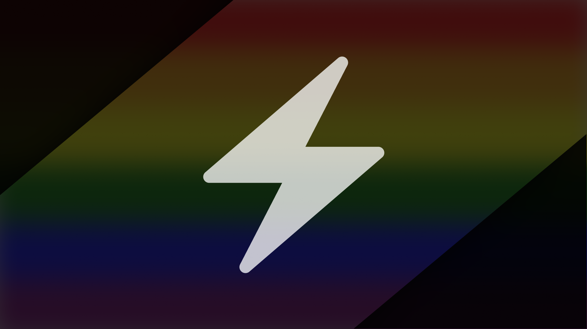

# Bolt 0.5.0-beta

---

## How to run this

**You don't,** if you want to have sanity by the end of the day. If you're fine
with losing your sanity, here's all the things you'll need:

- Deno 1.34.3 or higher with the unstable flag
- MongoDB 4 or higher
- Redis

Then, if you haven't died trying to figure all of that out, you'll need to
figure out which plugins you want to use.

## Platform feature support feature matrix thingy

Key: ✓ = supported, ~ = supported w/limitations, I = incomplete, T = todo, E =
eventually, X = not supported

|              | text | threads | forums |
| ------------ | ---- | ------- | ------ |
| bolt-bridge  | ✓    | ✓       | E      |
| bolt-discord | ✓    | ✓       | ✓      |
| bolt-guilded | ~    | T       | E      |
| bolt-matrix  | ~    | E       | X      |
| bolt-revolt  | ✓    | X       | X      |
